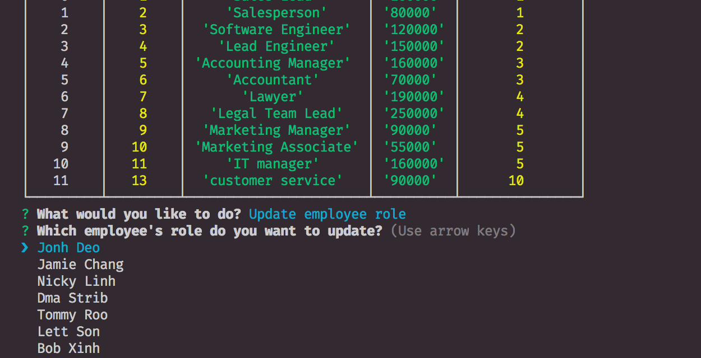

# EmployeeTracker

* This app use to view data of your company and you also can update all information.

# How to use

* Run node app.js
* Pick one of the following choices.

* View departments, roles, employees

